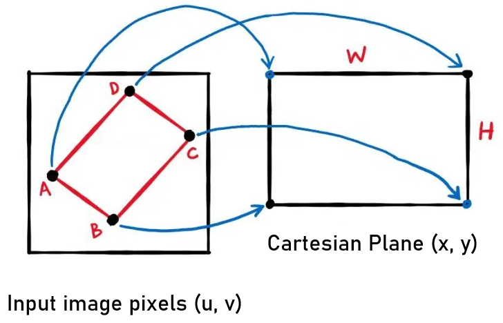
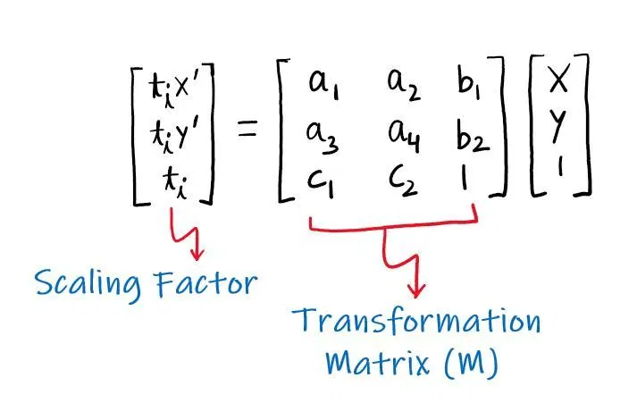
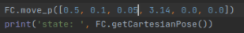
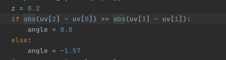
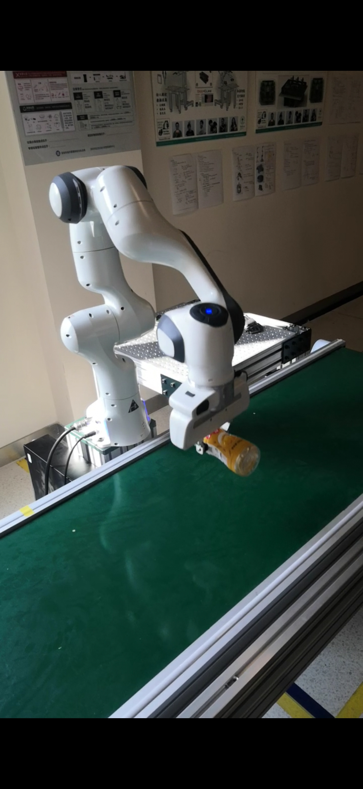
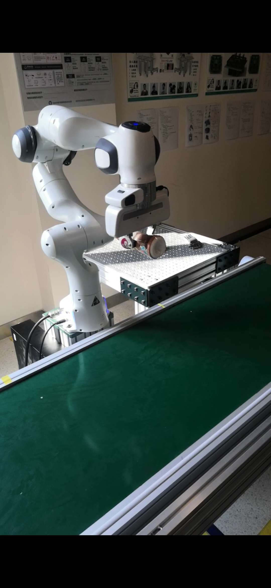
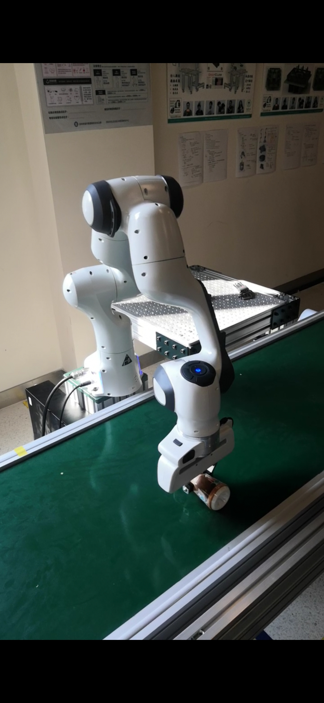
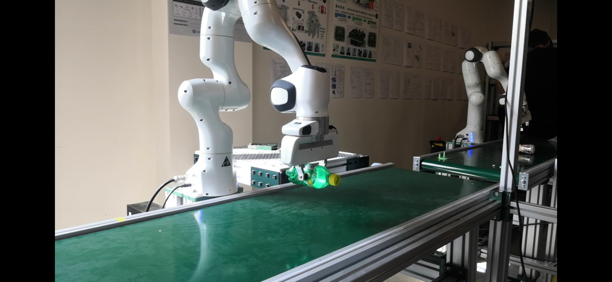

# ME336-Blue-Team-Pro1

## Project Goal
The project goal is to realize 2D grasping with manipulator.It is necessary to complete the debugging of the manipulator arm.Learn the principle and method of 2D hand - eye calibration.

## Equipment used
- A mechanical arm.
- One Realsense camera.
- A set of 2D calibration objects, including a pen nib 1 mounted on the end flange of the manipulator and a pen nib 2 placed on the table top.
- The computer.

## Principle of 2D calibration(Liu)
The 2D hand-eye calibration of the robotic arm and the camera is to obtain a perspective transformation matrix that can convert a point (u, v) in the camera's pixel space into a point on a plane in the base coordinate system of the robotic arm (x , y), at this time z is usually fixed, such as the height of a fixed horizontal desktop, (x, y) is the coordinate value of a certain point on the desktop relative to the base of the robot arm.

We use the built-in function "cv2.getPerspectiveTransform(pts1, pts2)" provided in OpenCV to obtain the perspective transformation matrix M. The perspective transformation can be expressed by the following equation. Then we collect 4 sets of (u, v) and the corresponding (x, y), and get the perspective transformation matrix M by solving the equation.

## The experimental steps
- The adjustment of Realsense camera (ZHANGYI)
    - Adjust the RealSense installation frame and turn on the RealSense camera.Turning the  display in reverse, a team member adjusts the Realsense universal joint by hand while keeping an eye on the camera field of view on the display to the right position, ensuring that the conveyor belt in the picture is level. 

- The debugging for the mechanical arm(ZHANGYI)
    - Turn on the power on the rear chassis of the manipulator and check whether the emergency stop switch is opened.
    - Connect the control box to the host using a network cable.
    - Open 192.168.1.101 in the browser and enter the control interface. Click "Click to Unlock Joints" to unlock each joint of the manipulator.
    - Open the enabling button of the manipulator arm and enter the programming mode.Enter the command to open PyCharm.Run FrankaController.py and observe the motion of the manipulator arm.Modify the target position of the manipulator many times to observe whether the movement of the manipulator is normal.

- 2D hand-eye calibration of manipulator and camera（机械臂与相机的2D手眼标定） (WangHuacen)
    - Install the calibration nib at the end of the mechanical arm's flange.
    - Execute 'realsense-viewer' in terminal and click "RGB Camera off" to open the camera.
    - Adjust the view in RealSense and camera to insure the platform in RealSense is horizontal and in the view..
    - Activate the mechanical arm.
    - Adjust the code at the end of the 'FrankaController.py' to '[x , y , 0.05 , 3.14 , 0 , 0]', x and y could be arbitrary value. In this project, we make [x, y] as [0.6, 0.3], [0.3, 0,3], [0.3, -0.2] and [0.6,-0.2] to calibrate a rectangular region for 2D grappling.

    

    - Transform the [x, y] to [u, v]:
        - Operate the FrankaController after adjusting the x, y values.
        - Place the calibrator on the platform, and make the calibrator and the calibration plate on the same vertical line.
        - Move the mechanical arm out of view in the RealSense.
        - Read the position of calibrator in Realsense as [u, v].
        - Adjust the [x, y] and [u, v] in 'cail2D.yaml'.
        - Repeting the process 6) to complete the calibration.

- The assembly of grriper onto the mechanical arm

- Defining the recognition range of the Realsense camera 
    - Opening Realsense-viewer in terminal

    - Defining a region of rectangle as the range of the recognition, where objects are put to be picked in the experiment.

    - Rocording the coordinates of the pixels at the corner of the rectangular.There is difference between the recognition area of  realsense camera and the mechanical arm. After getting the upper left and lower left coordinate of the recognition area, we may transform the coordinate into the standard for mechanical arm, using the matrix calculated in 2D calibration process.
    

- Opening main.py file in pycharm, modify the variable: crop_bounding using the coordinates of upper left and lower right corner pixels. (format: upper left(x1,y1) lower right(x2,y2) crop_bounding(y1,y2,x1,x2)

- Clearing all items within the recognition area only leaving the object to be picked by the gripper.

- Running the program file, watch the movement of the mechanical arm. 
    - If the grasping position of the gripper is still higher than the object to be picked, modify the value of z in the code to meet the prefered position
    - Remember to close the realsense-viewer before running the file 

    

## 项目完成度

## 项目过程中遇到问题与解决方案
- The gripper cannot be connected to the robotic arm. Solution: Reboot the system several times.
- There is still considerable error between arm and camera coordinates after calibration. Reason: The points used for calibration need to be further from each other.
- There is a mechanical limit inside the manipulator, after rotating a certain angle the arm will stop and can not continue to rotate in the direction. The problem can be solved by reseting the angle artificially.
- The arm will move to a position where there is no target object appears: Some variables with related to the final angle position was set wrongly.

## Contributing项目分工
- System: Zhang Yi 
- Algorithm: He Chongshan, Zhou Yuheng
- Software: Xie Songhua, Liu Zijian
- Data: Wang Huacen, Jiang Yuwei
- Design: Qiutian, Li Boxuan